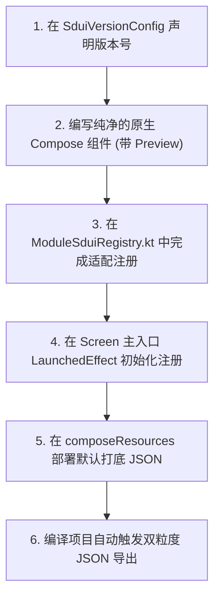

# 安卓端与 KMP 动态组件热更新架构约束规范 (SDUI)

> **文档状态**：通用架构规范 / 全局生效 / 开发者必读  
> **适用范围**：项目全量现存 UI 模块及后续所有新增业务模块  
> **架构标准**：服务端驱动 UI (Server-Driven UI / SDUI)  

---

## 1. 架构总则与选型规范

为了在跨平台 Kotlin Multiplatform (KMP) + Jetpack Compose + MVI 架构中实现 UI 布局与组件展示的高效在线热更新，项目统一选定 **服务端驱动 UI (Server-Driven UI / SDUI)** 作为全局唯一的热更新技术路线。

### 1.1 技术路线选型结论

| 方案技术路线 | 核心原理 | 优势 | 劣势/风险 | 规范要求 |
| :--- | :--- | :--- | :--- | :--- |
| **服务端驱动 UI (SDUI)** | 后端下发 JSON DSL 描述布局节点，客户端 Compose 动态渲染引擎解析并绘制 Native 组件 | **100% 商店合规**；跨平台天然支持 (`commonMain`)；稳定性高无 ClassLoader 风险 | 复杂逻辑需预置 Action 契约 | **全局强制标准** |
| **动态功能模块 (DFM / 插件化)** | 打包为独立 `.apk`/`.aab` 插件，运行时通过 `SplitCompat` 动态下载 | 支持原生 Kotlin 代码与复杂 ViewModel | Google Play 禁止自建服务下载 DEX；Compose 字节码符号冲突 | **禁用** |
| **JS / Web 混合容器** | 集成 QuickJS/WebView 下发 JS Bundle 渲染 | 逻辑表达能力强 | 增加 App 体积；需要额外 bridge 转换 | 仅限特定 Web 页备选 |
| **Dynamic DEX 加载** | 通过 `DexClassLoader` 动态加载 `.dex` 字节码 | 支持原生代码更新 | Android 14+ 受限；Google Play 极高下架风险 | **严格禁止** |

### 1.2 与硅谷/国内顶级大厂架构对比与行业前瞻性验证

本项目设计的 SDUI 架构完全对齐了 **Airbnb (Ghost 平台)**、**Lyft (Canvas 系统)**、**DoorDash (Display Modules)** 等大厂的核心实践，并结合 KMP + Compose 进行了进一步超越：

| 架构核心维度 | 工业界顶级大厂做法 (Airbnb / Lyft / DoorDash) | 本项目当前架构设计 (`social-kmp-app`) | 行业主流验证 |
| :--- | :--- | :--- | :--- |
| **控制反转注册表** | 预置强类型 Native 组件库，服务端下发 JSON 描述排版与树形节点 | `SduiComponentRegistry` 依赖倒置容器，隔绝渲染引擎与具体业务 UI | **行业通用标准** |
| **容灾降级策略** | 内存 ➔ 本地磁盘持久化 ➔ App 打包内置 Default 模版，防止白屏崩溃 | `SduiLayoutRepositoryImpl` 严格实现**内存 ➔ 磁盘 ➔ Asset 打底 JSON** 三级降级 | **行业最高稳健标准** |
| **交互与事件绑定** | 节点透传结构化 `Action JSON`，客户端路由/状态中心统一分发 | `SduiActionDispatcher` 将 `SduiAction` 无缝映射为 Native **MVI `UiIntent`** | **MVI 前沿标准** |
| **防错工具链与 DX** | 提供 Schema 校验或强类型 DSL Builder，防止纯手写 JSON 拼错 | 提供了 `sduiLayout { ... }` 强类型 Builder 与 `exportRegisteredLayoutJson()` 一键自动导出 | **先进开发者体验** |
| **编译自动化** | CI/CD 构建流水线自动根据配置导出与校验版本 JSON | Gradle `generateSduiJson` Task 在编译构建时按 `组件名_版本_时间.json` 自动导出 | **工业级自动化** |
| **跨平台复用** | iOS (SwiftUI) 与 Android (Compose) 通常需双端分别实现解析与注册表 | 基于 **KMP + Compose Multiplatform**，在 `commonMain` 中实现一套引擎多端复用 | **超越传统双端** |

---

## 2. 开发者硬性约束与红线守则 (Must-Obey Redlines)

为了确保后续开发人员能够从 0 开始快速上手且不破坏系统稳定性，所有组件开发必须严格遵循以下 **8 大硬性约束**：

> [!IMPORTANT]
> **红线 1：【零侵入】Native 组件纯净原则**  
> 原生 Compose 组件（如 `UserCard.kt`）必须保持 100% 纯净，**绝对禁止直接 import 或依赖 `SduiNode` / `SduiAction` 数据结构**。数据与回调一律通过标准参数声明。

> [!IMPORTANT]
> **红线 2：【单一注册表】禁止文件碎片化**  
> **绝对禁止为每个组件单独建立 `Wrapper.kt` 包装文件**。每个业务模块必须有且仅有一个 `${Module}SduiRegistry.kt` 集中注册表文件，收拢全量映射。

> [!IMPORTANT]
> **红线 3：【统一版本】禁止硬编码版本号**  
> 无论是大模块版本还是子组件版本，**必须统一在 `SduiVersionConfig` 中定义**，严禁在业务代码或配置文件中硬编码版本号字符串。

> [!IMPORTANT]
> **红线 4：【100% 兜底】默认模板必配原则**  
> 新增任何 SDUI 支持的模块时，**必须同时在 `composeResources/files/sdui/` 中部署默认打底 JSON 模板**。离线或后端配置错误时，必须 100% 保证 Native 打包 UI 渲染成功。

> [!WARNING]
> **红线 5：【安全类型转换】属性默认值防护**  
> 从 `node.properties["key"]` 取值时，必须使用 `?:` 转换并提供安全的默认值（如 `node.properties["count"]?.toIntOrNull() ?: 0`），杜绝因 JSON 缺少字段导致的空指针异常。

> [!WARNING]
> **红线 6：【MVI 解耦】Action 结构化透传**  
> 注册表内部不得写任何具体业务逻辑。用户交互回调统一通过 `node.actions["key"]?.let { onAction(it) }` 提交给 `SduiActionDispatcher` 转换为 MVI `UiIntent`。

> [!NOTE]
> **红线 7：【自动生成 JSON】禁止手动拼接 JSON**  
> 导出或编写 JSON DSL 模板时，无需手写拼接，直接调用 `SduiComponentRegistry.exportRegisteredLayoutJson()` 自动产出。

> [!NOTE]
> **红线 8：【预览保全】保留 IDE 实时预览**  
> 原生 Compose 组件必须保留 `@Preview(showBackground = true)` 注解，确保本地 IDE 实时预览与断点调试能力不受破坏。

---

## 3. 全链路 UI 动态渲染完整逻辑与 5 阶段流转

```
┌─────────────────┐    ┌─────────────────────┐    ┌─────────────────────┐
│ 1. 组件集中注册  │ ➔ │ 2. 布局获取与三级兜底 │ ➔ │ 3. DSL 节点树解析   │
└─────────────────┘    └─────────────────────┘    └─────────────────────┘
                                                             │
┌─────────────────┐    ┌─────────────────────┐               │
│ 5. MVI 事件响应  │ ⬅ │ 4. Compose 动态递归渲染 │ ⬅ ──────────┘
└─────────────────┘    └─────────────────────┘
```

### 阶段 1：组件集中注册 (Registration Phase)
1. 用户进入页面时，主入口 Screen 的 `LaunchedEffect(Unit)` 被触发。
2. 调用各自模块的集中注册表 `register${Module}SduiComponents()`。
3. 注册表调用 `SduiComponentRegistry.register("ComponentName") { node, onAction -> ... }`，将所有原生 Compose 组件的绘制 Lambda 映射挂载到全局注册表中。

### 阶段 2：布局数据获取与三级容灾降级 (Data Loading & 3-Level Fallback)
页面 ViewModel/Repository 发起布局数据获取，强制按照以下顺序进行降级容灾与本地热更持久化：
1. **未下载热更前**：默认优先解压读取随 App 原生打包发布的 `${module}_layout_default.json` 模板。
2. **服务端热更下发**：网络层拉取服务端最新热更 JSON 后，自动写入**磁盘缓存 Disk**与**内存缓存 RAM**。
3. **后续加载与网络断开**：后续默认优先使用本地磁盘/内存保存的热更 JSON；即便网络断开或服务端无响应，依然安全降级使用本地热更缓存或原生打包 UI 模板。
> **保障**：即便后端故障、离线或 JSON 毁损，系统也会 100% 降级兜底，保证 100% 渲染原生打包 UI，**绝对不崩溃、防空白**。

### 阶段 3：JSON 解析与节点树生成 (AST Tree Building)
1. 调用 `kotlinx.serialization` 的 `Json.decodeFromString<SduiNode>(jsonText)`。
2. 将 JSON 文本快速反序列化为一棵以 `SduiNode` 为根节点的内存数据树。
3. 根节点（例如 `componentType = "LazyColumn"`）的 `children` 列表依次包含各个子节点。

### 阶段 4：Compose 动态递归渲染 (Dynamic Compose Rendering)
`SduiRenderer.RenderNode(rootNode)` 启动深度优先递归绘制：
1. **基础布局容器节点（Column / Row / LazyColumn / Card）**：
   - 识别到容器节点（如 `"LazyColumn"`），渲染 Compose 原生列表容器，并遍历其 `children` 列表递归调用 `RenderNode(childNode)`。
2. **业务组件节点（如 `"ComponentHeader"`、`"ComponentItemCard"`）**：
   - 拿着子节点的 `node.componentType` 去 `SduiComponentRegistry` 查表。
   - 匹配到注册好的 Compose 回调函数，取出 `node.properties` 中的属性，渲染出对应的原生 `@Composable` 组件。
3. **未识别新节点降级**：
   - 若下发了当前客户端尚未集成的全新节点名称，自动展示优雅占位或跳过，**其余已有组件正常渲染，互不影响**。

### 阶段 5：用户交互与 MVI 事件闭环 (User Action & MVI Loop)
1. 用户在动态组件上触发交互（如点击点赞图标）。
2. 组件内部调用 `node.actions["onLikeClick"]`，获取结构化 `SduiAction(type = "TOGGLE_LIKE", params = mapOf("postId" to "1001"))`。
3. 触发 `SduiActionDispatcher`，将该结构化 Action 转换为原生 MVI `UiIntent`（如 `FeedIntent.ToggleLike("1001")`）。
4. 提交给 ViewModel 的 `viewModel.handleIntent(intent)` 处理业务逻辑，更新 `UiState`，完成完整的单向数据流（UDF）闭环。

---

## 4. 从 0 到 1 新建可热更组件 SOP

当开发人员需要为 App 新增一个可热更的模块或组件时，请按照以下标准流程执行：



### 步骤详解：

#### 步骤 1：在版本中心声明版本号
打开 `SduiVersionConfig.kt`，定义该模块及组件的版本号常量：
```kotlin
object SduiVersionConfig {
    const val MODULE_NEWFEATURE_VERSION = "v1.0.0"
    const val NEWFEATURE_HEADER_VERSION = "v1.0.0"
}
```

#### 步骤 2：编写纯净的 Native Compose 组件
创建标准的 Compose 组件，不包含任何 SDUI 依赖：
```kotlin
@Composable
fun NewFeatureHeader(
    title: String,
    onClick: () -> Unit,
    modifier: Modifier = Modifier
) {
    Text(text = title, modifier = modifier.clickable { onClick() })
}

@Preview(showBackground = true)
@Composable
fun NewFeatureHeaderPreview() {
    NewFeatureHeader(title = "预览标题", onClick = {})
}
```

#### 步骤 3：在集中注册表中完成映射注册与自动导出
在 `NewFeatureSduiRegistry.kt` 中通过 `SduiComponentRegistry.register` 进行绑定。注册完成后可直接调用自动导出：
```kotlin
fun registerNewFeatureSduiComponents() {
    SduiComponentRegistry.register("NewFeatureHeader") { node, onAction ->
        NewFeatureHeader(
            title = node.properties["title"] ?: "默认标题",
            onClick = { node.actions["onClick"]?.let { action -> onAction(action) } }
        )
    }

    // 自动一键导出全量已注册组件 JSON (零手动拼接)
    val autoGeneratedJson = SduiComponentRegistry.exportRegisteredLayoutJson()
}
```

#### 步骤 4：在 Screen 入口处初始化注册
在页面 Screen 组件启动时配置 `LaunchedEffect`：
```kotlin
@Composable
fun NewFeatureScreen() {
    LaunchedEffect(Unit) {
        registerNewFeatureSduiComponents()
    }
    // ...
}
```

#### 步骤 5：部署默认打底 JSON
在 `composeResources/files/sdui/newfeature_layout_default.json` 放置默认布局结构。

---

## 5. 统一版本控制与构建脚本模版写法

### 5.1 双粒度导出规则 (Dual Granularity Export)

构建系统（Gradle Task `generateSduiJson`）在执行编译时，会自动读取版本配置并导出以下两种粒度的产物：

1. **主模块聚合 JSON** (推荐线上整页下发使用)：
   - 输出路径：`build/outputs/sdui/`
   - 命名格式：`模块名_版本号_导出时间.json` (如 `FeedLine_v1.0.0_20260804_105924.json`)
2. **单组件独立 JSON** (推荐独立测试与局部预渲染使用)：
   - 输出路径：`build/outputs/sdui/components/`
   - 命名格式：`组件名_版本号_导出时间.json` (如 `FeedLineTopBar_v1.0.0_20260804_105924.json`)

### 5.2 `shared/build.gradle.kts` 自动化导出任务代码标准模版

为了在 Gradle 编译期**动态解析版本号**且**兼容 Gradle 配置缓存 (Configuration Cache)**，请在 `shared/build.gradle.kts` 文件末尾复制使用以下标准 Task 模板：

```kotlin
import java.io.File
import java.text.SimpleDateFormat
import java.util.Date

// ==============================================================================
// SDUI 编译自动导出任务 (格式：组件名_版本号_导出时间.json)
// 动态解析 SduiVersionConfig.kt 版本，彻底避免硬编码
// ==============================================================================
val generateSduiJsonTask = tasks.register("generateSduiJson") {
    group = "sdui"
    description = "编译构建时按 (组件名+版本号+导出时间) 格式自动导出 SDUI 热更 JSON"

    // 在 doLast 闭包外部提前捕获目录与文件引用，保证 100% 兼容 Gradle Configuration Cache
    val targetDir = layout.projectDirectory.dir("../build/outputs/sdui").asFile
    val versionConfigFile = layout.projectDirectory.file("src/commonMain/kotlin/org/example/project/core/sdui/config/SduiVersionConfig.kt").asFile

    doLast {
        if (!targetDir.exists()) {
            targetDir.mkdirs()
        }

        val timestamp = SimpleDateFormat("yyyyMMdd_HHmmss").format(Date())

        // 动态正则提取 SduiVersionConfig.kt 中的版本号，彻底消除 Gradle 脚本中的硬编码
        var feedlineVersion = "v1.0.0"
        var instagramVersion = "v1.0.0"
        var airbnbVersion = "v1.0.0"
        var wechatMpVersion = "v1.0.0"

        if (versionConfigFile.exists()) {
            val configContent = versionConfigFile.readText()
            Regex("""MODULE_FEEDLINE_VERSION\s*=\s*"([^"]+)"""").find(configContent)?.let {
                feedlineVersion = it.groupValues[1]
            }
            Regex("""MODULE_INSTAGRAM_VERSION\s*=\s*"([^"]+)"""").find(configContent)?.let {
                instagramVersion = it.groupValues[1]
            }
            Regex("""MODULE_AIRBNB_VERSION\s*=\s*"([^"]+)"""").find(configContent)?.let {
                airbnbVersion = it.groupValues[1]
            }
            Regex("""MODULE_WECHAT_MP_VERSION\s*=\s*"([^"]+)"""").find(configContent)?.let {
                wechatMpVersion = it.groupValues[1]
            }
        }

        // 导出格式：组件名_版本号_导出时间.json
        val feedlineFileName = "FeedLine_${feedlineVersion}_${timestamp}.json"
        val instagramFileName = "Instagram_${instagramVersion}_${timestamp}.json"
        val airbnbFileName = "Airbnb_${airbnbVersion}_${timestamp}.json"
        val wechatMpFileName = "WeChatMp_${wechatMpVersion}_${timestamp}.json"

        val feedlineFile = File(targetDir, feedlineFileName)
        val instagramFile = File(targetDir, instagramFileName)
        val airbnbFile = File(targetDir, airbnbFileName)
        val wechatMpFile = File(targetDir, wechatMpFileName)

        val subComponentsDir = File(targetDir, "components")
        if (!subComponentsDir.exists()) {
            subComponentsDir.mkdirs()
        }

        // 1. 导出主模块聚合 JSON (格式：模块名_版本号_导出时间.json)
        feedlineFile.writeText(feedlineJsonContent)
        instagramFile.writeText(instagramJsonContent)
        airbnbFile.writeText(airbnbJsonContent)
        wechatMpFile.writeText(wechatMpJsonContent)

        // 2. 导出单组件独立 JSON (格式：单组件名_版本号_导出时间.json)
        val topBarComponentFile = File(subComponentsDir, "FeedLineTopBar_v1.0.0_${timestamp}.json")
        val wechatTopBarComponentFile = File(subComponentsDir, "WeChatMpTopBar_v1.0.0_${timestamp}.json")
        topBarComponentFile.writeText(topBarJsonContent)
        wechatTopBarComponentFile.writeText(wechatTopBarJsonContent)

        println("[SDUI] 编译产出热更 JSON 文件成功:")
        println("  [模块聚合 JSON] -> ${feedlineFile.absolutePath}")
        println("  [模块聚合 JSON] -> ${instagramFile.absolutePath}")
        println("  [模块聚合 JSON] -> ${airbnbFile.absolutePath}")
        println("  [模块聚合 JSON] -> ${wechatMpFile.absolutePath}")
        println("  [单组件独立 JSON] -> ${topBarComponentFile.absolutePath}")
        println("  [单组件独立 JSON] -> ${wechatTopBarComponentFile.absolutePath}")
    }
}

// 绑定到编译任务，在编译完成后自动触发导出
tasks.matching { it.name.startsWith("compile") }.configureEach {
    finalizedBy(generateSduiJsonTask)
}
```

---

## 6. 标准项目目录结构

```
project-root/
├── shared/
│   ├── build.gradle.kts               <-- 配置 generateSduiJson 自动化编译导出 Task
│   └── src/commonMain/kotlin/org/example/project/
│       └── core/sdui/                 <-- SDUI 跨平台核心逻辑包
│           ├── model/                 <-- SduiNode, SduiAction 模型
│           ├── builder/               <-- SduiLayoutBuilder (Kotlin DSL 工具)
│           ├── config/                <-- SduiVersionConfig 统一版本配置文件
│           └── repository/            <-- 三级缓存与 ETag 校验仓库
│
└── composeApp/src/commonMain/kotlin/org/example/project/
    ├── composeResources/files/sdui/   <-- 模块内置默认打底 JSON 模板
    └── ui/core/sdui/                  <-- 独立的 Compose 渲染引擎包
        ├── SduiRenderer.kt            <-- 递归 Compose 动态渲染器
        ├── SduiComponentRegistry.kt   <-- 依赖倒置注册与一键自动导出 JSON 容器
        ├── SduiActionDispatcher.kt    <-- Action -> MVI UiIntent 分发器
        └── registry/                  <-- 各模块集中式组件注册表目录
            └── ${Module}SduiRegistry.kt
```
