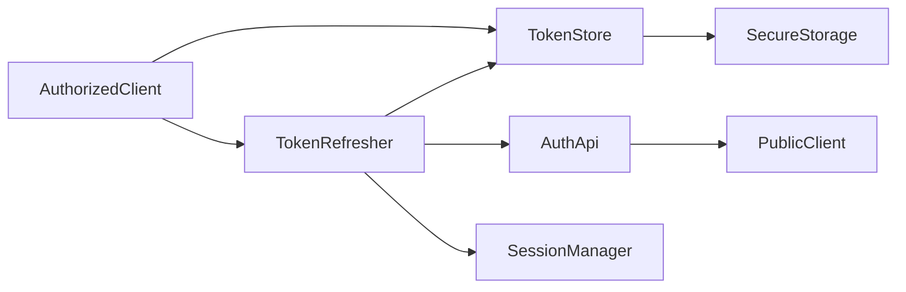
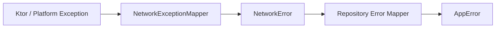

# KMP 整体网络架构设计规范

> **文档版本**：3.6  
> **网络架构版本**：1.0.0  
> **更新日期**：2026-07-30  
> **适用模块**：`shared` (`commonMain`, `androidMain`, `iosMain`), `composeApp`, `androidApp`, `iosApp`  
> **文档范围**：全局网络基础设施、跨平台能力边界、客户端分类与安全控制规范

---

## 1. 文档范围与非目标

### 1.1 适用范围
- 跨平台网络基础设施（位于 `shared/src/commonMain/core/network`）。
- 平台专属 HTTP 引擎与安全存储适配（`androidMain` 与 `iosMain`）。
- 业务数据层接入网络基础设施的统一契约与错误映射规则。

### 1.2 非目标
- 不定义具体业务模块（如 FeedLine、Instagram、私信）的数据模型与 API 字段。
- 不包含数据同步与离线 Outbox 队列策略（详见 [数据同步与离线策略](./数据同步与离线策略.md)）。
- 不包含图片/多媒体渲染与本地缓存算法（由 Coil 框架处理）。

---

## 2. 模块与平台能力边界

### 2.1 职责划分
- **`commonMain`**：必须集中处理所有 HTTP 请求编排、JSON 序列化、Auth 认证、重试与错误映射。
- **平台 Source Sets**：平台层仅负责原生 HTTP 引擎绑定、安全存储（Keystore / Keychain）、设备版本及网络状态监听。

### 2.2 平台 HTTP 引擎支持矩阵

| 引擎能力 | Android (OkHttp Engine) | iOS (Darwin Engine) | 架构规范约束 |
|---|---|---|---|
| **Request Timeout** | 支持 | 支持 | 全局主防护，普通 REST 默认 20 秒 |
| **Connect Timeout** | 支持 (6 秒) | **不支持** | Darwin 不支持 `HttpTimeout.connectTimeoutMillis`，连接建连由 iOS 系统底层 `NSURLSession` 接管 |
| **Socket Timeout** | 支持 | 支持 | 相邻数据读写等待，默认 10 秒（必须小于 Request Timeout，以便优先识别链路停滞） |
| **安全存储** | Keystore / EncryptedPrefs | Keychain Services | 平台分别实现 `SecureStorage` 接口 |

---

## 3. HttpClient 分类体系

规范定义四种职责分离的客户端类别。`PublicClient` 与 `AuthorizedClient` 必须隔离；`UploadClient` 和 `RealtimeClient` 按功能启用并独立创建。

| 客户端 | 适用场景 | 认证方式 | 默认超时 | 重试策略 |
|---|---|---|---|---|
| **`PublicClient`** | 登录、注册、公开配置、Token 刷新 | 无 | 普通 REST (Req 20s / Sock 10s) | 仅幂等读取重试，设总预算上限 |
| **`AuthorizedClient`** | 绝大多数需鉴权业务 REST 接口 | Bearer Token 自动注入与刷新 | 普通 REST (Req 20s / Sock 10s) | 仅幂等读取重试，设总预算上限 |
| **`UploadClient`** | 图片、视频、文件二进制上传 | 预签名 URL 或 Bearer Token | 独立分片超时或流式总截止时间 | 禁止自动重试写请求 |
| **`RealtimeClient`** | WebSocket、长连接信令 | 握手参数/Header 校验 | 引擎独立心跳 | 应用层重连管理 |

---

## 4. 公共配置与超时规范

### 4.1 普通 REST 参数规范表

| 配置项 | 默认值 | 设计原则与约束 |
|---|---|---|
| **Request Timeout** | 20 秒 | 单次 HTTP 请求的最终时间上限。正常响应完成后立即结束，超时仅为异常最大等待时间 |
| **Connect Timeout** | Android 6 秒 / Darwin 不支持 | 建立 TCP/TLS 连接等待时间 |
| **Socket Timeout** | 10 秒 | 相邻两次数据读写空闲等待。**必须小于 Request Timeout**，用于在建连后长无数据时优先识别链路停滞 |
| **幂等重试次数** | 2 次 | 加上首次请求，总尝试次数最多 3 次 |
| **逻辑总重试预算** | 25 秒 | 包含重试与退避时间在内的前台交互总预算，避免单次超时叠加重试导致用户长时间等待 |
| **可重试方法** | `GET`、`HEAD`、`OPTIONS` | 禁止任何写方法自动重试 |
| **可重试状态码** | `408`, `429`, `500`, `502`, `503`, `504` | 遇 429 优先尊重 `Retry-After` Header |

### 4.2 超时与上传防护规则
- **必须**：`HttpTimeout` 插件必须安装在 `HttpRequestRetry` 插件**之后**。
- **必须**：前台交互请求必须限制自动重试次数并设置逻辑总预算（总等待时间上限），防止多次超时叠加拖垮 UI 体验。
- **必须**：慢查询、后台同步与文件上传**必须使用独立的 HttpClient / 超时配置**，禁止通过放宽全局 REST 超时来兼容。
- **必须**：文件上传应优先采用分片或可恢复上传 (Resumable Upload)，为每个分片设置有限的 Request Timeout 与 Socket Timeout。
- **必须**：只有在流式上传等特殊场景下才允许取消整体 Request Timeout，且**必须同时提供业务总截止时间 (Deadline)、进度监控与用户手动取消机制**。
- **必须**：捕获 `kotlinx.io.IOException` 与超时异常；**必须重新抛出 `CancellationException`**。
- **禁止**：生产环境默认 `LogLevel.NONE`；确需诊断时最多使用 `HEADERS`，禁止记录 Body。
- **必须**：脱敏 Header 必须涵盖 `Authorization`、`Cookie`、`Set-Cookie`。

---

## 5. 认证与会话管理



### 约束
- **强制**：`TokenStore.loadTokens` 只能读取本地安全存储，可以是挂起函数，禁止发起网络请求。
- **必须**：Token 刷新必须使用 `PublicClient` 调用 `AuthApi`，避免 401 递归死锁。
- **互斥**：单个 `AuthorizedClient` 内的并发 401 由 Ktor Auth 合并刷新；存在多个鉴权客户端、主动刷新入口或跨客户端刷新时，由 `TokenRefresher` 提供应用级 single-flight 控制。

---

## 6. 错误体系与映射流程



### 约束
- **必须**：`CancellationException` 必须原样重新抛出，禁止转为普通网络错误。
- **网络错误** (`core/network`)：`NetworkError` 包含 `NoConnection`、`Timeout`、`Unauthorized`、`Forbidden`、`NotFound`、`RateLimited`、`Conflict(statusCode, serverVersion)`（包含 409 Conflict 与 412 Precondition Failed）、`Server(code)`、`Serialization`、`UpdateRequired`、`Unknown`。
- **领域错误示例** (`domain/error`)：网络基础设施映射的典型领域错误包含 `NetworkUnavailable`、`LoginExpired`、`PermissionDenied`、`DataConflict`（由 `NetworkError.Conflict` 映射）、`UpdateRequired(requiredBuild: Long)`、`ServerFailure(code)`。（注：业务层独立错误如 `InvalidData` 不属于网络映射层）。

---

## 7. 安全与可观测性

- **必须**：生产环境强制使用 HTTPS；`AuthorizedClient` 的 Token 仅向官方 API 域名发送。
- **必须**：每个逻辑请求具有唯一 `X-Request-Id`；具体实现由网络插件负责。
- **必须**：监测 `Deprecation`（RFC 9745）与 `Sunset`（RFC 8594）响应头；客户端比较整数 Build Number (`X-Min-App-Build-Required`)，若当前应用 `currentBuild < requiredBuild` 则抛出 `ForceUpdateException`（版本名称仅用于 UI 展示）。
- **应当**：WebSocket 重连由应用层 `RealtimeConnectionManager` 负责，底层引擎只负责连接和心跳。

---

## 8. 生命周期与依赖注入

### 8.1 容器接口定义
```kotlin
interface NetworkContainer {
    val publicClient: HttpClient
    val authorizedClient: HttpClient
    val uploadClient: HttpClient?
    val realtimeClient: HttpClient?

    fun close()
}
```

---

## 9. 测试清单

- [ ] MockEngine 验证网络 Header、参数与 401 刷新合并。
- [ ] 验证 GET 幂等请求最多重试 2 次，POST 写请求零自动重试。
- [ ] 验证 Socket Timeout (10s) < Request Timeout (20s) 以及逻辑总重试预算 (25s) 生效。
- [ ] 验证 `CancellationException` 被正确重新抛出。
- [ ] 验证 409 Conflict 与 412 Precondition Failed 映射为 `NetworkError.Conflict`。
- [ ] 验证日志脱敏包含 `Authorization`、`Cookie`、`Set-Cookie`。
- [ ] 验证第三方域名不携带 Bearer Token。
- [ ] Android OkHttp (Connect Timeout 6s) 与 iOS Darwin 平台集成测试。

---

## 10. 目标 Gradle 依赖矩阵

具体版本由项目统一的 Version Catalog (`gradle/libs.versions.toml`) 管理。

```toml
# shared/src/commonMain
deps = [
    "libs.kotlinx.coroutines.core",
    "libs.kotlinx.io.core",
    "libs.kotlinx.serialization.json",
    "libs.ktor.client.core",
    "libs.ktor.client.content.negotiation",
    "libs.ktor.serialization.kotlinx.json",
    "libs.ktor.client.auth",
    "libs.ktor.client.logging",
    "libs.ktor.client.websockets" # (可选: 仅 Realtime 模块需要)
]

# shared/src/androidMain
deps = ["libs.ktor.client.okhttp"]

# shared/src/iosMain
deps = ["libs.ktor.client.darwin"]

# shared/src/commonTest
deps = ["libs.ktor.client.mock"]
```

---

## 附录：核心工厂接口

```kotlin
package org.example.project.core.network

interface NetworkClientFactory {
    fun createPublicClient(): HttpClient
    fun createAuthorizedClient(): HttpClient
    fun createUploadClient(): HttpClient?
    fun createRealtimeClient(): HttpClient?
}
```
