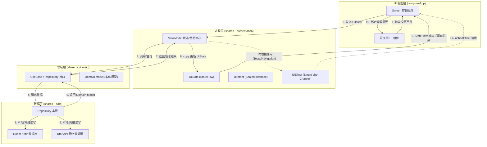

# Social KMP 项目架构与 MVI 单向数据流约束规范

> **文档版本**：1.0.0  
> **架构版本**：MVI + KMP Compose Architecture v1.0  
> **更新日期**：2026-08-11  
> **适用模块**：`shared` (`commonMain`), `composeApp` (`commonMain`)  
> **文档范围**：ViewModel设计准则、MVI架构单向数据流 (UDF) 约束、跨平台代码分层与目录隔离规范、UI交互与扩展约束

---

## 1. 架构总览与核心设计原则

本项目（`social-kmp-app`）基于 **Kotlin Multiplatform (KMP)** 与 **Compose Multiplatform** 构建，全面采用 **MVI (Model-View-Intent)** 架构模式。架构的核心目标是实现**高度解耦、强类型安全、无副作用且可预测的单向数据流 (Unidirectional Data Flow, UDF)**。

### 1.1 全局架构拓扑图



### 1.2 核心设计原则

1. **单一数据源原则 (Single Source of Truth)**：页面的全部 UI 展现状态统一收敛于 ViewModel 维护的 `UiState` 中。UI 视图不持有独立的业务状态，仅作为 `UiState` 的被动渲染器。
2. **单向数据流 (UDF)**：数据严格按照 `UI -> UiIntent -> ViewModel -> Domain/Data -> UiState -> UI` 的单向环路流动。严禁 UI 直接修改 ViewModel 中的状态。
3. **单一领域实体原则 (Single Entity Principle)**：禁止为同属一条信息流的变体视图（如 Feed 动态、Story 快拍）创建重复多余的实体类，统一复用核心聚合实体（如 `InstagramPost`），通过字段组合满足不同 UI 的展示需求。
4. **无副作用渲染 (Side-Effect Free)**：Compose UI 函数必须保持幂等与纯净，所有持久化、网络请求及状态变更逻辑必须交由 ViewModel 与 Repository 层处理。

---

## 2. MVI 单向数据流 (UDF) 核心三要素

MVI 架构由 **UiState**（页面状态）、**UiIntent**（用户意图）与 **UiEffect**（一次性副作用管道）三大核心元素构成。

```
┌─────────────────────────────────────────────────────────────┐
│                          Compose UI                         │
└──────────────┬───────────────────────────────▲──────────────┘
               │ 1. handleIntent(intent)       │ 2. StateFlow<UiState>
               │                               │ 3. Channel<UiEffect>
┌──────────────▼───────────────────────────────┴──────────────┐
│                         ViewModel                           │
└─────────────────────────────────────────────────────────────┘
```

### 2.1 UiState (页面状态模型)

- **定义与形态**：必须使用 Kotlin `data class` 或 `sealed class / interface` 定义，代表该页面当前瞬间的完整状态镜像。
- **不可变性 (Immutability)**：`UiState` 中的所有属性必须使用 `val` 声明，禁止使用 `var`。ViewModel 中更新状态必须通过 `_uiState.update { it.copy(...) }` 方式产生新实例。
- **默认值防护**：`UiState` 必须提供完整的默认构造参数或初始状态，确保页面在冷启动订阅时可无缝完成首屏渲染。

```kotlin
/**
 * FeedLine 页面 UI 状态模型
 */
data class FeedLineUiState(
    val isLoading: Boolean = false,
    val posts: List<InstagramPost> = emptyList(),
    val errorMessage: String? = null,
    val isRefreshing: Boolean = false
) : UiState
```

### 2.2 UiIntent (用户意图)

- **定义与形态**：必须使用 `sealed interface` 或 `sealed class` 统一收敛页面内所有可触发的操作事件（如页面加载、下拉刷新、点击点赞、提交评论、长按删除等）。
- **统一入口分发**：ViewModel **必须且仅能**暴露唯一的 `fun handleIntent(intent: UiIntent)` 入口。严禁在 ViewModel 中为每个 UI 交互暴露独立的 `public fun onXxxClicked()` 方法。

```kotlin
/**
 * FeedLine 页面用户意图密封接口
 */
sealed interface FeedLineUiIntent : UiIntent {
    data object LoadInitialData : FeedLineUiIntent
    data object RefreshFeed : FeedLineUiIntent
    data class LikePost(val postId: String) : FeedLineUiIntent
    data class DeletePost(val postId: String) : FeedLineUiIntent
}
```

### 2.3 UiEffect (一次性副作用管道)

- **定义与形态**：用于处理**非持续性状态**的一次性事件（如弹窗 Toast/Snackbar、页面 Navigation 跳转、列表自动 Scroll 到顶部等）。
- **通道机制**：ViewModel 内部使用 `Channel<UiEffect>(Channel.BUFFERED)` 管理，并通过 `receiveAsFlow()` 暴露给外部。
- **UI 消费约束**：UI 视图层必须在 `LaunchedEffect` 携程块中订阅并消费 `UiEffect`，确保事件仅被消费一次，避免因屏幕旋转或 Recomposition 导致重复触发。

```kotlin
/**
 * FeedLine 页面一次性副作用事件
 */
sealed interface FeedLineUiEffect : UiEffect {
    data class ShowToast(val message: String) : FeedLineUiEffect
    data class NavigateToDetail(val postId: String) : FeedLineUiEffect
    data object ScrollToTop : FeedLineUiEffect
}
```

---

## 3. ViewModel 规范与职责边界

`ViewModel` 是 MVI 架构中状态计算与意图调度的核心节点。

### 3.1 ViewModel 标准结构规范

ViewModel 必须严格遵循以下三要素公开标准结构：

```kotlin
/**
 * FeedLineViewModel 状态与意图处理中心
 */
class FeedLineViewModel(
    private val repository: FeedRepository
) : ViewModel() {

    // 1. 内部可变状态与外部只读 StateFlow
    private val _uiState = MutableStateFlow(FeedLineUiState())
    val uiState: StateFlow<FeedLineUiState> = _uiState.asStateFlow()

    // 2. 一次性副作用 Channel 管道
    private val _uiEffect = Channel<FeedLineUiEffect>(Channel.BUFFERED)
    val uiEffect: Flow<FeedLineUiEffect> = _uiEffect.receiveAsFlow()

    // 3. 唯一的意图分发入口
    fun handleIntent(intent: FeedLineUiIntent) {
        viewModelScope.launch {
            when (intent) {
                is FeedLineUiIntent.LoadInitialData -> loadInitialData()
                is FeedLineUiIntent.RefreshFeed -> refreshFeed()
                is FeedLineUiIntent.LikePost -> handleLikePost(intent.postId)
                is FeedLineUiIntent.DeletePost -> handleDeletePost(intent.postId)
            }
        }
    }

    private suspend fun loadInitialData() {
        _uiState.update { it.copy(isLoading = true) }
        runCatching { repository.fetchFeedList() }
            .onSuccess { list ->
                _uiState.update { it.copy(isLoading = false, posts = list) }
            }
            .onFailure { error ->
                _uiState.update { it.copy(isLoading = false, errorMessage = error.message) }
                _uiEffect.send(FeedLineUiEffect.ShowToast(error.message ?: "加载失败"))
            }
    }

    private suspend fun handleLikePost(postId: String) {
        // 乐观更新 UI State
        _uiState.update { current ->
            val updated = current.posts.map { if (it.id == postId) it.copy(isLiked = !it.isLiked) else it }
            current.copy(posts = updated)
        }
        // 后台网络同步
        repository.toggleLike(postId)
    }
}
```

### 3.2 ViewModel 九项硬性约束

1. **禁存 UI 引用**： ViewModel 中**绝对禁止**持有 Android `Context`、`Activity`、`View` 或 Compose `State` 等 UI 层对象的引用。
2. **只读 StateFlow**：`MutableStateFlow` 必须严格收敛在 ViewModel `private` 作用域内，只能向外部暴露 Read-Only 的 `StateFlow`。
3. **单一入口分发**：所有 UI 交互动作必须组装为 `UiIntent` 通过 `handleIntent(intent)` 传入，禁止开辟额外的 `public` 业务逻辑入口。
4. **作用域安全**：所有异步任务（网络请求、数据库读写）必须运行在 `viewModelScope` 内，确保 ViewModel 销毁时协程能自动取消。
5. **乐观更新与容灾回滚**：针对高频交互（如点赞、收藏），优先执行 UI 状态乐观更新；网络失败后再回滚状态并发送 `ShowToast` 副作用。
6. **副作用防丢与防重**：副作用必须使用 `Channel.BUFFERED`，UI 侧消费必须在 `LaunchedEffect` 中 `collect`。
7. **无空格注释**：ViewModel 内的中英文混排注释须遵守项目通用规范，中英文字符间严禁多余空格。
8. **依赖注入解耦**：ViewModel 所依赖的 Repository/UseCase 必须通过构造函数注入接口，禁止在 ViewModel 内部直接实例化具体实现类。
9. **KDoc 标准头**：ViewModel Kotlin 文件顶部必须包含标准 `@File`、`@Package`、`@Description`、`@Author`、`@Date` 注释块。

---

## 4. 模块分层与代码文件放置规范

本项目代码结构严格划分 `shared` 跨平台逻辑模块与 `composeApp` 视图 UI 模块。

### 4.1 目录分层对照表

| 架构层级 | 对应源码目录 | 核心职责与放置类 |
|---|---|---|
| **Domain 层 (领域)** | `shared/src/commonMain/.../domain/model/` | 领域实体数据模型（如 `InstagramPost`） |
| | `shared/src/commonMain/.../domain/repository/` | 数据仓库契约接口（如 `FeedRepository`） |
| **Data 层 (数据)** | `shared/src/commonMain/.../data/repository/` | Repository 接口实现类、Ktor API 接入与 Room DAO 交互 |
| **Presentation 层 (表现)** | `shared/src/commonMain/.../presentation/intent/` | 模块 MVI Intent 密封接口（如 `FeedLineUiIntent`） |
| | `shared/src/commonMain/.../presentation/state/` | 模块 MVI UiState 页面状态模型（如 `FeedLineUiState`） |
| | `shared/src/commonMain/.../presentation/effect/` | 模块 MVI Effect 一次性事件（如 `FeedLineUiEffect`） |
| | `shared/src/commonMain/.../presentation/viewmodel/` | ViewModel 状态与意图处理中心 |
| **UI 视图层 (界面)** | `composeApp/src/commonMain/.../ui/components/` | 可复用的无状态原子/复合 Compose UI 组件 |
| | `composeApp/src/commonMain/.../ui/screens/` | 主页面 Screen 容器组件（负责 ViewModel 绑定与 State 收集） |
| | `composeApp/src/commonMain/.../ui/theme/` | 模块主题、颜色常量与 Typography 排版规范 |

### 4.2 模块引用边界依赖禁令

- `domain` 模块为最底层纯净逻辑，**严禁依赖** `data`、`presentation` 或 `composeApp` 的任何代码。
- `presentation` 模块只能依赖 `domain`，**严禁直接 import `composeApp` 中的 UI 组件**。
- `composeApp` UI 组件层只能通过 `UiState` 与 `UiIntent` 与 `presentation` 通信，组件内部**绝对禁止**直接编写数据持久化或 HTTP 请求代码。

---

## 5. Compose UI 组件交互与渲染约束

### 5.1 组件交互 Lambda 导出规范

为了保持 UI 组件的极致可复用性与测试性，所有纯 UI 组件（如 `InstagramPostItem`、`FeedLinePostCard`）必须满足：

1. **全量交互导出**：组件中**所有**交互（点击、长按、双击、头像点击、用户名点击、点赞/收藏/评论/分享点击等）必须通过 `() -> Unit` 或 `(T) -> Unit` 参数暴露给上层。
2. **默认空实现**：每个交互 Lambda 参数**必须提供默认空实现**（如 `= {}`），确保组件可以单独调用与预览。

```kotlin
/**
 * 可复用 Post 卡片 UI 组件
 */
@Composable
fun InstagramPostItem(
    post: InstagramPost,
    modifier: Modifier = Modifier,
    onAvatarClick: (userId: String) -> Unit = {},
    onLikeClick: (postId: String) -> Unit = {},
    onCommentClick: (postId: String) -> Unit = {},
    onShareClick: (postId: String) -> Unit = {}
) {
    // 纯 UI 渲染逻辑，无任何 ViewModel 引用
}
```

### 5.2 强制 `@Preview` 预览规范

- 在 `ui/components/*` 及 `ui/screens/*` 中创建的所有 UI 组件文件末尾，**必须**配置标准的 `@Preview` 预览函数。
- **显式显示背景**：所有 `@Preview` 注解必须配置 `showBackground = true`（即 `@Preview(showBackground = true)`）。
- **免注释要求**：`@Preview` 预览函数上方不需要添加任何文档注释。
- **主题包裹**：预览函数统一包裹在所属模块主题（如 `InstagramTheme`）下，并配合 Dummy 数据，保证 IDE 设计视图即时渲染。

### 5.3 视觉、多语言与避让收敛

- **硬编码颜色禁用**： Compose 代码中严禁直接使用 `Color(0xFF...)`，所有颜色必须统一定义在 `InstagramColor.kt` / `Theme.kt` 中。
- **字符串硬编码禁用**：UI 文本严禁直接书写中英文硬编码字符串，必须统一收录至 `composeResources/values` 的 `strings_*.xml` 中，通过 `stringResource(Res.string.xxx)` 读取。
- **状态栏避让**：顶部 App 导航栏组件（TopBar）或全屏 Screen 必须妥善处理系统状态栏避让（如应用 `.statusBarsPadding()`）。

---

## 6. SDUI 动态组件热更新与 MVI 事件闭环

在 Server-Driven UI (SDUI) 动态组件场景下，MVI 架构通过 **SduiActionDispatcher** 与原生 MVI 数据流无缝无缝融合。

### 6.1 SDUI 到 MVI 事件闭环流程

```
┌─────────────────┐      ┌─────────────────────────┐      ┌───────────────────────┐
│ SDUI 动态组件    │ ───> │ SduiAction (JSON 描述)   │ ───> │ SduiActionDispatcher  │
└─────────────────┘      └─────────────────────────┘      └───────────┬───────────┘
                                                                      │ 转换映射
                                                                      ▼
┌─────────────────┐      ┌─────────────────────────┐      ┌───────────────────────┐
│ UI 重新渲染     │ <─── │ StateFlow<UiState>      │ <─── │ ViewModel.handleIntent│
└─────────────────┘      └─────────────────────────┘      └───────────────────────┘
```

### 6.2 接入三原则

1. **Native 组件纯净原则**：原生 Compose UI 组件保持纯净，**绝对禁止直接 import 或依赖 `SduiNode` / `SduiAction` 数据结构**。
2. **Action 到 Intent 安全映射**：在集中注册表 (`${Module}SduiRegistry.kt`) 中，解包 SDUI 节点的 `actions` 参数，由 `SduiActionDispatcher` 转化为 Native 的 MVI `UiIntent` 并发往 `ViewModel.handleIntent()`。
3. **启动隔离**：SDUI 热更 JSON 查询与下载必须在后台异步执行，绝对不得阻塞 `AppInitializer` 阶段的网络与数据库同步初始化。

---

## 7. 本地持久化与序列化约束

### 7.1 开发阶段数据库免迁移原则

- 当前项目处于积极迭代开发阶段（Active Development），后续任何数据库结构调整、实体字段改动或表增删，**严禁引入**任何数据库版本升级与 Migration 迁移代码（如 Room `Migration`、`addMigrations()`）。
- **变更处理机制**：当数据库 Schema 或 Entity 结构变更时，直接修改 Entity/DAO 表结构定义与数据映射即可，无需维护版本迁移日志。

### 7.2 `@Serializable` 强制校验

- 所有需要进行 JSON 序列化的数据类（包括 Room Entity 中的 JSON 存取字段、Ktor 网络 API 响应 DTO、SDUI 节点数据等），**必须**显式标注 `@Serializable` 注解，防止运行时触发 `SerializationException` 崩溃。

### 7.3 全局统一图片与多媒体缓存基础设施约束

- **统一工厂收敛**：所有平台的 `ImageLoader` 工厂必须收敛至 `createAppImageLoader(context)`，严禁各 Screen 模块私自构建独立的图片引擎。
- **多级缓存标准**：默认挂载 25% 堆内存 `MemoryCache` 与 256MB 物理文件 `DiskCache`（`StorageArea.CACHE/image_cache`）。
- **用户媒体落盘红线**：用户通过系统相册选择器（FileKit）选取的照片与视频，在进入发布/入库流程前**必须**经由 `MediaPersister` 复制至应用私有存储区（`StorageArea.PERSISTENT`），严禁将易过期的系统临时 `content://` URI 直接存入数据库。

---

## 8. 架构规范执行检查清单 (Architectural Compliance Checklist)

开发者在提交 Pull Request 或完成代码功能前，必须按本清单自查：

- [ ] **ViewModel 入口单一性**：ViewModel 是否只暴露了唯一的 `handleIntent(intent)` 接口？
- [ ] **StateFlow 只读防护**：`MutableStateFlow` 是否为 `private`？对外是否暴露只读 `StateFlow`？
- [ ] **UiEffect 管道正确性**：一次性事件是否使用 `Channel.BUFFERED` 发送，并在 UI 侧 `LaunchedEffect` 中 `collect`？
- [ ] **代码分层合规**：`domain` 层是否 100% 独立于 `presentation` / `ui`？
- [ ] **Compose 组件解耦**：组件中的回调 Lambda 是否均导出且包含默认空实现 (`= {}`)？
- [ ] **Preview 规范**：所有 UI 组件末尾是否添加了 `@Preview(showBackground = true)`？
- [ ] **无硬编码**：是否存在未收敛的 `Color(0xFF...)` 或硬编码 UI 字符串？
- [ ] **中英文排版**：代码注释中的中英文混排是否符合无空格约束？
- [ ] **序列化注解**：所有 DTO 与 SDUI 节点模型是否加盖了 `@Serializable` 注解？
