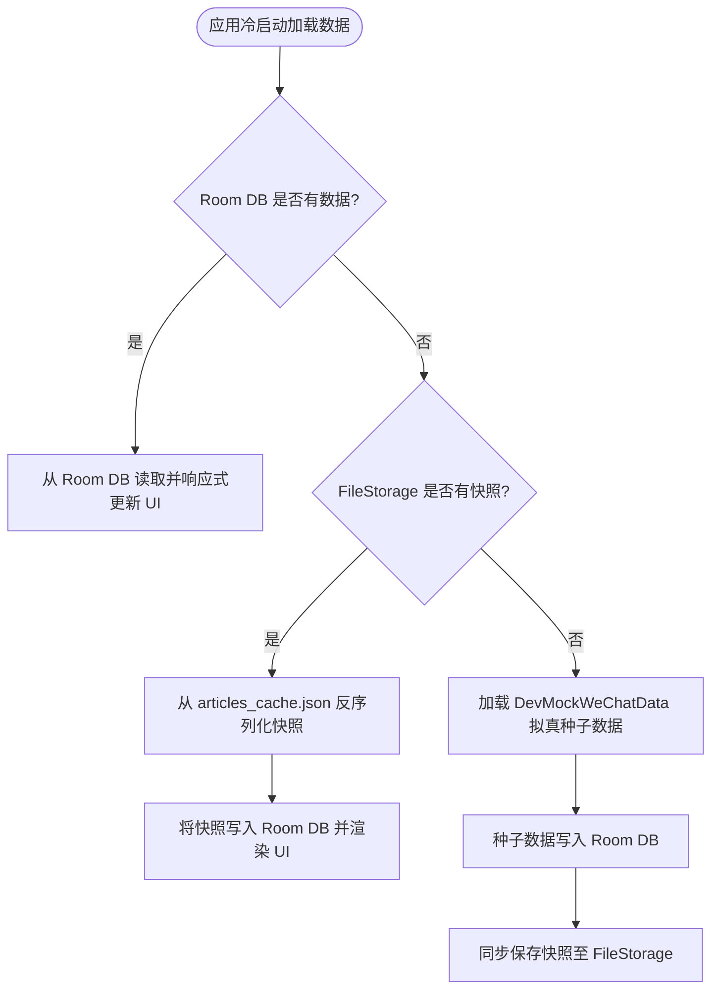

# 微信公众号与看一看瀑布流技术方案设计 (WeChat MP Feature Specification)

> **模块名称**：微信公众号与看一看瀑布流信息流 (WeChat MP & Look-Around Waterfall Feed)  
> **所属层次**：`composeApp` (UI/SDUI 渲染) + `shared` (MVI / Room KMP / FileStorage / SDUI DSL / 埋点)  
> **核心架构**：MVI 架构 + Local-First SWR 离线数据库 + FileStorage 磁盘快照缓存 + SDUI 动态组件热更新 + 响应式断点适配

---

## 1. 业务背景与交互概述

微信公众号模块模拟了微信订阅号聚合流与“看一看”混合信息流的核心体验：
1. **顶部导航栏 (TopBar)**：返回键、标题（订阅号消息）、搜索与订阅号消息管理快捷入口。
2. **常读公众号头像条 (Frequently Read Bar)**：水平横向滑动列表，展示高频阅读的公众号头像、名称与未读小绿点，点击支持消除未读标记。
3. **常读置顶头条卡片 (Featured Banner Card)**：置顶头条大图 Banner 卡片，展示主标题、副标题摘要、阅读数、在看数、发布时间及“更多消息 >”跳转条。
4. **看一看混合瀑布流 (Waterfall Stream)**：
   - **单列左文右图卡片 (Horizontal Card)**：左侧标题与副标题、右侧圆角缩略方图、已关注公众号“关注的号”小蓝标。
   - **单列通栏大图卡片 (Banner Large Card)**：上方标题、中部通栏大图、底部公众号信息与屏蔽按钮。
   - **双列瀑布流大图卡片 (Waterfall Grid Card)**：交错高度封面大图、底部两行大标题与来源账号。
   - **双列视频大图卡片 (Video Card)**：封面居中播放按钮蒙层、视频时长标签及阅读点赞数据。
5. **不感兴趣负反馈 (Dislike BottomSheet)**：点击卡片右下角屏蔽按钮触发底部抽屉，提供“内容质量差/标题党”、“重复/已看过”、“对此公众号不感兴趣”、“违规内容”等理由，提交后实时剔除并持久化同步至数据库与文件缓存。

---

## 2. 架构设计与技术全景

### 2.1 整体架构分层 (Layered Architecture)

```
+-----------------------------------------------------------------------------------+
|               composeApp UI Layer (Compose Multiplatform & SDUI Registry)         |
|  - WeChatMpScreen (下拉刷新 / 触底加载 / 相对布局断点 / 动态组件容器)                |
|  - WeChatMpTopBar / WeChatMpFrequentlyReadBar / WeChatMpFeaturedBannerCard       |
|  - WeChatMpHorizontalCard / WeChatMpWaterfallCard / WeChatMpDislikeBottomSheet   |
|  - WeChatMpSduiRegistry (SDUI 动态组件热更中央注册表，6 大组件独立热更)              |
+------------------------------------------+----------------------------------------+
                                           |
                                           | MVI (Intent / UiState / Effect)
                                           v
+-----------------------------------------------------------------------------------+
|                       shared Presentation Layer (MVI ViewModel)                   |
|  - WeChatMpViewModel (androidx.lifecycle.ViewModel 跨平台 ViewModel)             |
|  - WeChatMpIntent (Refresh / LoadMore / ClickArticle / Dislike / Search / etc.)   |
|  - WeChatMpUiState (accountsState / featuredState / waterfallState / Dislike)     |
|  - WeChatMpEffect (ShowToast / OpenArticle / ScrollToTop)                         |
+------------------------------------------+----------------------------------------+
                                           |
                                           v
+-----------------------------------------------------------------------------------+
|                         shared Domain Layer (Domain Contract)                     |
|  - WeChatAccount / WeChatArticle / WeChatCardType                                 |
|  - WeChatMpRepository (数据仓库契约接口)                                          |
+------------------------------------------+----------------------------------------+
                                           |
                                           v
+-----------------------------------------------------------------------------------+
|                          shared Data Layer (Multi-Tier Storage)                   |
|  - WeChatMpRepositoryImpl (多级缓存容灾与离线优先调度)                              |
|  +-----------------------------------+   +------------------------------------+   |
|  |     Room KMP 2.7.0+ 本地持久化    |   |     FileStorage 统一磁盘快照缓存   |   |
|  | (WeChatMpDao / WeChatArticleEntity)|   | (StorageArea.CACHE: articles_cache)|   |
|  +-----------------------------------+   +------------------------------------+   |
+-----------------------------------------------------------------------------------+
```

---

## 3. 多级缓存容灾与数据持久化

模块采用 **`内存RAM ➔ Room本地DB ➔ FileStorage磁盘文件缓存 ➔ DevMock种子数据`** 四级容灾机制：



---

## 4. 相对布局与全端响应式断点适配

基于 `rememberWeChatWindowSizeClass()` 实现了全端自适应响应式布局：

| 设备类型 / 断点 | 宽度区间 | 瀑布流列数 (`getWaterfallColumnCount`) | 最大内容宽度 (`getMaxAdaptiveContentWidth`) |
| :--- | :--- | :--- | :--- |
| **手机竖屏 (Compact)** | `< 600dp` | **2 列** (小屏手机 1 列) | 填充全宽 (`Modifier.fillMaxWidth()`) |
| **手机横屏/折叠屏 (Medium)** | `600dp ~ 840dp` | **3 列** | 最大约束 `720dp` 并水平居中 |
| **平板/桌面端 (Expanded)** | `≥ 840dp` | **4 列** | 最大约束 `960dp` 并水平居中 |

---

## 5. SDUI 动态组件热更新注册

遵循 `sdui-hotupdate` 规范，所有微信公众号组件均纳入动态热更管理：

- **版本配置** ([`SduiVersionConfig.kt`](file:///d:/coding/social-kmp-app/shared/src/commonMain/kotlin/org/example/project/core/sdui/config/SduiVersionConfig.kt))：
  - 模块版本：`MODULE_WECHAT_MP_VERSION = "v1.0.0"`
  - 组件版本：`TOPBAR = "v1.0.0"`、`FREQUENTLY_READ_BAR = "v1.0.0"`、`FEATURED_BANNER = "v1.0.0"`、`HORIZONTAL_CARD = "v1.0.0"`、`WATERFALL_CARD = "v1.0.0"`、`DISLIKE_SHEET = "v1.0.0"`
- **单一集中注册表** ([`WeChatMpSduiRegistry.kt`](file:///d:/coding/social-kmp-app/composeApp/src/commonMain/kotlin/org/example/project/ui/core/sdui/registry/WeChatMpSduiRegistry.kt))：
  - 绑定原生 Compose 组件与 MVI Intent 派发，无侵入性。
- **自动编译 Task**：
  - `./gradlew :shared:generateSduiJson` 自动输出 `WeChatMp_v1.0.0_<timestamp>.json` 模块聚合与单组件 JSON。

---

## 6. 数据埋点与用户行为监控

数据埋点完全对齐 [`AnalyticsConstants.kt`](file:///d:/coding/social-kmp-app/shared/src/commonMain/kotlin/org/example/project/core/analytics/AnalyticsConstants.kt) 规范：

| 交互场景 | 对应事件 (Event) | 核心上报参数 (Params) |
| :--- | :--- | :--- |
| **页面曝光** | `enter_screen` | `screen_name: "wechat_mp_screen"`, `module_name: "wechat_mp"` |
| **页面退出** | `leave_screen` | `screen_name: "wechat_mp_screen"`, `module_name: "wechat_mp"` |
| **启动页入口点击** | `wechat_mp_open` | `module_name: "wechat_mp"`, `is_success: true` |
| **下拉刷新** | `wechat_mp_refresh` | `module_name`, `is_success`, `error_msg` |
| **触底分页加载** | `wechat_mp_load_more` | `module_name`, `is_success` |
| **文章卡片点击** | `wechat_article_click` | `article_id`, `account_id`, `is_success` |
| **常读公众号点击** | `wechat_account_click` | `account_id`, `is_success` |
| **不感兴趣按钮触发** | `wechat_dislike_click` | `article_id`, `is_success` |
| **不感兴趣理由提交** | `wechat_dislike_submit`| `article_id`, `dislike_reason`, `is_success` |
| **顶部栏搜索按钮** | `wechat_search_click` | `module_name`, `is_success` |
| **顶部栏订阅管理** | `wechat_profile_click`| `module_name`, `is_success` |

---

## 7. 质量保证与测试验证

已通过全量自动化单元测试验证：
- **`WeChatMpDaoTest`**：Room KMP 数据库 CRUD、按时间戳降序流式监听与置顶过滤。
- **`WeChatMpRepositoryImplTest`**：空库种子填充、SWR 刷新、分页追加、负反馈删除、FileStorage 磁盘快照持久化。
- **`WeChatMpViewModelTest`**：基于 `StandardTestDispatcher` 的 MVI 全意图状态流转与副作用验证。
- **`WeChatMpSduiTest`**：SDUI 版本集中配置、DSL 节点构建与 Native 回退降级。
